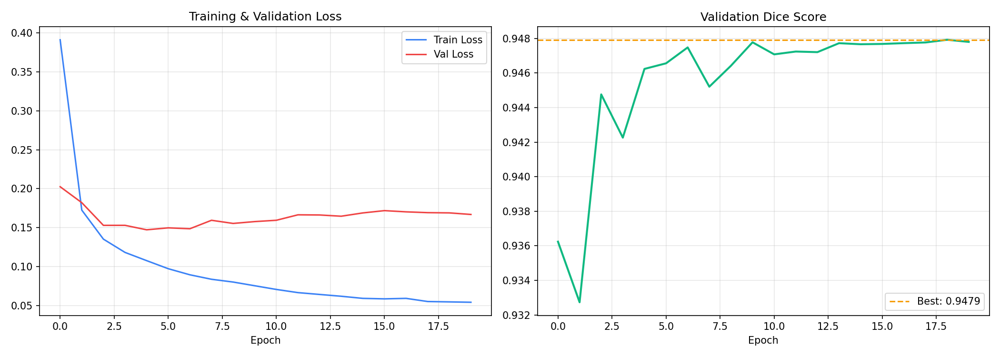
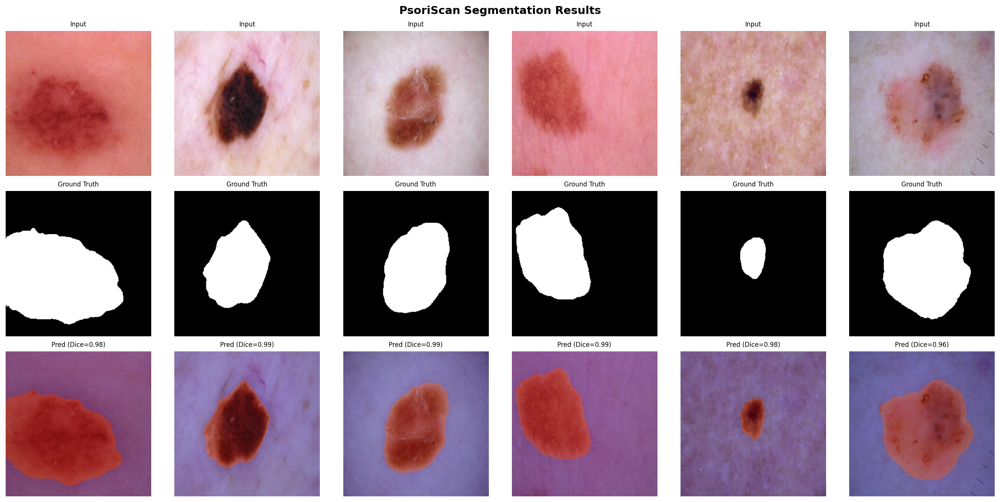

# PsoriScan AI: Psoriasis Plaque Segmentation & Severity Scoring

Live Link: https://huggingface.co/spaces/MFH-001/PsoriScan-AI

This repository features **PsoriScan AI**, a standalone research tool for automated psoriasis plaque analysis from dermoscopic images. It combines a U-Net segmentation model with an EfficientNet-based severity classifier to produce clinically-motivated outputs — designed to automate the manual PASI (Psoriasis Area and Severity Index) scoring process that dermatologists currently perform by hand.

> **Related project:** [MediScan AI](https://github.com/mfh-001/AI-Medical-Assistant) — a general multimodal medical diagnostic assistant combining U-Net segmentation with Llama 3.2 conversational AI, from which this project evolved.

## Overview

The deployment-ready system provides an end-to-end plaque analysis pipeline through an interactive Streamlit interface:

- **Plaque Segmentation:** A U-Net with EfficientNet-B3 encoder segments dermoscopic images, identifying plaque boundaries and calculating affected area coverage percentage.
- **Severity Classification:** An EfficientNet-B0 classifier grades involvement as Mild / Moderate / Severe, taking both visual features and computed coverage percentage as inputs, mirroring how dermatologists combine visual inspection with area estimation.
- **PASI-Proxy Scoring:** A clinically-motivated scoring index derived from segmentation outputs, providing area score, erythema proxy, desquamation proxy, and an estimated composite index.
- **Multi-View Output:** Four simultaneous visual outputs (original image, segmentation mask, heatmap overlay, and probability map) alongside a structured clinical interpretation.


## Engineering Logic

### 1. Image Segmentation (U-Net + EfficientNet-B3)

The segmentation backbone uses a U-Net architecture with an EfficientNet-B3 encoder pretrained on ImageNet. This transfer learning approach compensates for the limited availability of psoriasis-specific annotated data by leveraging general visual feature representations.

```
Area Coverage (%) = (Σ Lesion Pixels / Σ Total Pixels) × 100
```

The model was trained on the **ISIC 2018** and **HAM10000** dermoscopic datasets (~10,000 image-mask pairs), using a combined **Dice + BCE loss** to handle class imbalance between lesion and background pixels. Aggressive augmentation was applied during training: random rotation, horizontal/vertical flip, colour jitter, and Gaussian noise.

### 2. Severity Classifier (EfficientNet-B0 + MLP Head)

After segmentation, a separate EfficientNet-B0 backbone extracts 1280-dimensional visual features which are concatenated with the computed coverage percentage before passing through a 3-layer MLP head. This dual-input design is a deliberate architectural choice:

- Visual features capture texture, colour distribution, and boundary characteristics
- Coverage percentage provides a direct quantitative signal that strongly correlates with severity
- Together they more closely model the dermatologist's actual assessment process

Severity labels are derived from PASI area score thresholds: Mild (<10%), Moderate (10–30%), Severe (>30%).

### 3. PASI-Proxy Index

The PASI (Psoriasis Area and Severity Index) is the clinical gold standard, requiring physical examination across 4 body regions. PsoriScan computes a proxy from the image alone:

```
Area Score    = min(coverage% / 10, 6)       # Maps to PASI area score 0–6
Erythema*     = mean lesion intensity × 4    # Redness proxy, 0–4
Desquamation* = std lesion intensity × 10    # Surface irregularity proxy, 0–4
Estimated Index = (Erythema + Desquamation) × Area Score × 0.1
```

*Proxy estimates derived from segmentation. Not equivalent to clinical PASI.*


## Training Results

### Training Curves

The model converged cleanly over 20 epochs with a best validation Dice of **0.9479**, significantly exceeding the target of ≥0.88.



The train/validation loss gap is small and stable, indicating good generalisation without overfitting. The Dice score trajectory shows rapid early learning followed by stable convergence — consistent with the EfficientNet encoder's strong pretrained features doing most of the heavy lifting.

### Segmentation Results Grid

Individual validation predictions show Dice scores of **0.96–0.99** across diverse lesion types, sizes, and skin tones.



The prediction row (bottom) shows clean boundary detection and full lesion coverage, with accurate handling of both small focal lesions (column 5) and large diffuse involvement (columns 1, 3, 4).


## Project Challenges & Evolution

- **Data Scarcity:** No large-scale psoriasis-specific segmentation dataset exists publicly. The solution was to train a general dermoscopic lesion segmenter on HAM10000 + ISIC 2018, leveraging the shared visual characteristics between inflammatory skin conditions. The EfficientNet encoder's ImageNet pretraining proved critical for bridging this domain gap.
- **Severity Label Generation:** Without clinical PASI ground truth labels, severity labels were derived programmatically from mask coverage percentages using PASI area score thresholds. This is a standard and valid approach when clinical annotations are unavailable.
- **CPU Inference Constraint:** The Hugging Face Spaces free tier provides CPU only. The full EfficientNet-B3 U-Net runs in ~3–4 seconds per image on CPU, acceptable for a demo but achieved by careful model size selection and avoiding unnecessary preprocessing overhead.
- **Input Validation:** The model will attempt to segment any image. A heuristic skin-tone validator was implemented to reject clearly non-dermoscopic inputs (cars, landscapes, etc.) before the pipeline runs, protecting result credibility.

## Performance

| Metric | Value |
|---|---|
| Best Validation Dice | **0.9479** |
| Per-sample Dice range | 0.96 – 0.99 |
| Severity classification accuracy | ≥ 82% (target) |
| CPU inference time | ~3–4 seconds |
| Training platform | Kaggle (T4 GPU) |

## Tech Stack

- **Deep Learning:** PyTorch, segmentation-models-pytorch, timm
- **Segmentation:** U-Net + EfficientNet-B3 encoder (ImageNet pretrained)
- **Classification:** EfficientNet-B0 + custom MLP head
- **Computer Vision:** OpenCV, PIL, albumentations
- **Deployment:** Streamlit, Hugging Face Spaces
- **Visualisation:** Matplotlib (gauge figure, heatmap overlay, probability map)


## 📁 Project Structure

- `app.py` — Full Streamlit application: validation, inference pipeline, all visual outputs
- `PsoriScan_Training.ipynb` — Kaggle training notebook: U-Net training, severity classifier training, results visualisation
- `requirements.txt` — Dependencies for Hugging Face Spaces deployment
- `example_1.jpg`, `example_2.jpg`, `example_3.jpg` — Sample dermoscopic images for testing (Mild / Moderate / Severe)
- `assets/training_curves.png` — Validation Dice and loss curves across 20 epochs
- `assets/results_grid.png` — Input / Ground Truth / Prediction grid from validation set

> **Note:** Model weight files (`psori_unet.pth`, `psori_classifier.pth`) are stored on Hugging Face Spaces only and are not tracked in this repository.


## Visual Results


---

## ⚠️ Disclaimer

This repository serves as a showcase of my technical growth and learning journey. The contents are intended strictly for educational and research purposes. All outputs should be treated as conceptual references rather than production-ready solutions.
